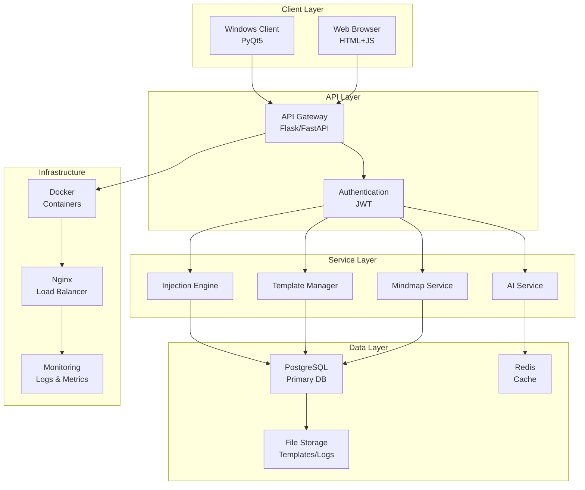
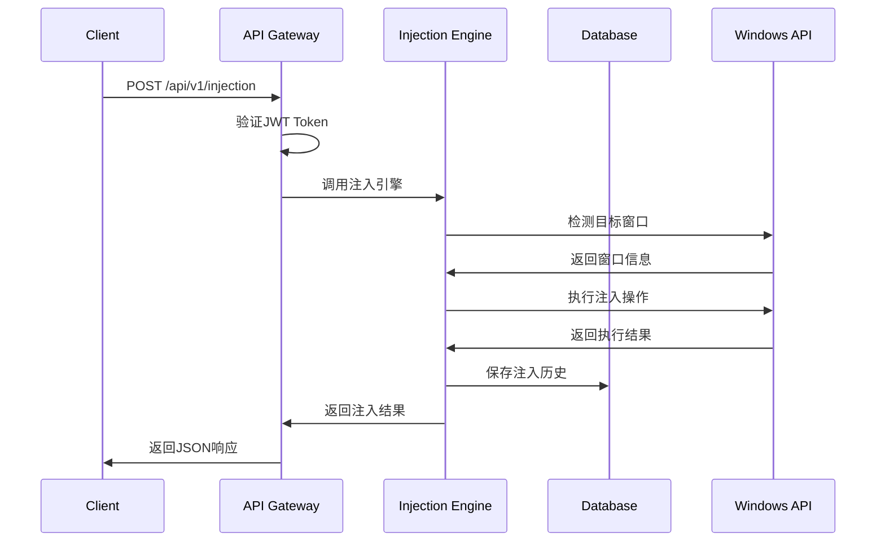
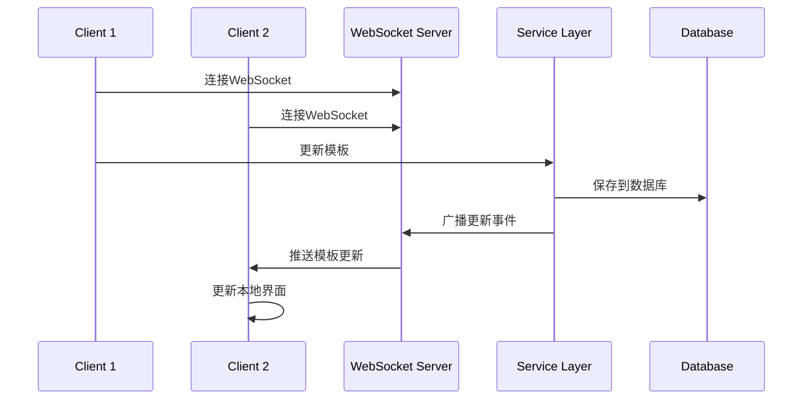

# Injection V2 架构设计文档

## 🎯 架构概述

Injection V2 采用现代化的客户端-服务器分离架构，专为跨平台部署和企业级扩展而设计。

## 🏗️ 整体架构图



## 🏢 分层架构详述

### 1. 客户端层 (Client Layer)

#### Windows 客户端
```
client/windows/
├── main.py                 # 应用入口
├── ui/
│   ├── main_window.py     # 主窗口
│   ├── dialogs/           # 对话框组件
│   └── widgets/           # 自定义控件
├── services/
│   ├── api_client.py      # API客户端
│   └── local_injection.py # 本地注入功能
└── utils/
    ├── config.py          # 配置管理
    └── logger.py          # 日志管理
```

**设计原则**：
- 保留Windows专用功能（本地注入）
- 通过API与服务端通信
- 离线模式支持

#### Web 客户端
```
client/web/
├── index.html             # 主页面
├── assets/
│   ├── css/              # 样式文件
│   ├── js/               # JavaScript模块
│   └── images/           # 图像资源
├── components/
│   ├── injection-panel.js # 注入控制面板
│   ├── template-manager.js # 模板管理器
│   └── mindmap-viewer.js  # 脑图查看器
└── services/
    ├── api-service.js     # API服务
    └── websocket-client.js # WebSocket客户端
```

**设计原则**：
- 响应式设计，支持移动端
- 模块化组件架构
- 实时数据同步

### 2. API层 (API Layer)

#### API网关设计
```python
# server/api/gateway.py
from flask import Flask, request, jsonify
from flask_restful import Api, Resource
from functools import wraps

class APIGateway:
    def __init__(self):
        self.app = Flask(__name__)
        self.api = Api(self.app)
        self.setup_routes()
        
    def setup_routes(self):
        # 注入相关API
        self.api.add_resource(InjectionAPI, '/api/v1/injection')
        # 模板相关API  
        self.api.add_resource(TemplateAPI, '/api/v1/templates')
        # 脑图相关API
        self.api.add_resource(MindmapAPI, '/api/v1/mindmap')
```

#### 认证授权
```python
# server/auth/jwt_auth.py
import jwt
from datetime import datetime, timedelta

class JWTAuth:
    def __init__(self, secret_key):
        self.secret_key = secret_key
        
    def generate_token(self, user_id):
        payload = {
            'user_id': user_id,
            'exp': datetime.utcnow() + timedelta(hours=24)
        }
        return jwt.encode(payload, self.secret_key, algorithm='HS256')
        
    def verify_token(self, token):
        try:
            payload = jwt.decode(token, self.secret_key, algorithms=['HS256'])
            return payload['user_id']
        except jwt.ExpiredSignatureError:
            return None
```

### 3. 服务层 (Service Layer)

#### 命令注入引擎
```python
# shared/injection_engine/core.py
class InjectionEngine:
    def __init__(self):
        self.calibration = WindowCalibration()
        self.detector = WindowDetector()
        self.injector = CommandInjector()
        
    async def execute_injection(self, command, target_window=None):
        """执行7步注入流程"""
        # Step 1: 窗口检测
        if not target_window:
            target_window = await self.detector.detect_active_window()
            
        # Step 2: 窗口校准
        calibration_data = await self.calibration.calibrate(target_window)
        
        # Step 3-7: 执行注入
        result = await self.injector.inject(command, calibration_data)
        return result
```

#### 模板管理服务
```python
# shared/template_manager/manager.py
class TemplateManager:
    def __init__(self, storage):
        self.storage = storage
        self.validator = TemplateValidator()
        
    async def create_template(self, template_data):
        # 验证模板
        if not self.validator.validate(template_data):
            raise TemplateValidationError()
            
        # 保存模板
        template_id = await self.storage.save(template_data)
        return template_id
        
    async def get_templates(self, user_id, category=None):
        return await self.storage.get_by_user(user_id, category)
```

#### 脑图服务
```python
# shared/mindmap/service.py
class MindmapService:
    def __init__(self):
        self.adapter = JSMindAdapter()
        self.converter = DataConverter()
        
    async def create_mindmap(self, injection_data):
        # 转换注入数据为脑图格式
        mindmap_data = self.converter.convert(injection_data)
        
        # 生成JSMind兼容格式
        jsmind_data = self.adapter.format(mindmap_data)
        return jsmind_data
```

### 4. 数据层 (Data Layer)

#### 数据库设计
```sql
-- 用户表
CREATE TABLE users (
    id SERIAL PRIMARY KEY,
    username VARCHAR(50) UNIQUE NOT NULL,
    email VARCHAR(100) UNIQUE NOT NULL,
    password_hash VARCHAR(255) NOT NULL,
    created_at TIMESTAMP DEFAULT CURRENT_TIMESTAMP
);

-- 模板表
CREATE TABLE templates (
    id SERIAL PRIMARY KEY,
    user_id INTEGER REFERENCES users(id),
    name VARCHAR(100) NOT NULL,
    content TEXT NOT NULL,
    category VARCHAR(50),
    is_public BOOLEAN DEFAULT FALSE,
    created_at TIMESTAMP DEFAULT CURRENT_TIMESTAMP
);

-- 注入历史表
CREATE TABLE injection_history (
    id SERIAL PRIMARY KEY,
    user_id INTEGER REFERENCES users(id),
    template_id INTEGER REFERENCES templates(id),
    command TEXT NOT NULL,
    target_window VARCHAR(255),
    status VARCHAR(20) NOT NULL,
    executed_at TIMESTAMP DEFAULT CURRENT_TIMESTAMP
);

-- 脑图数据表
CREATE TABLE mindmaps (
    id SERIAL PRIMARY KEY,
    user_id INTEGER REFERENCES users(id),
    name VARCHAR(100) NOT NULL,
    data JSONB NOT NULL,
    created_at TIMESTAMP DEFAULT CURRENT_TIMESTAMP
);
```

#### 缓存策略
```python
# server/cache/redis_cache.py
import redis
import json

class RedisCache:
    def __init__(self, host='localhost', port=6379, db=0):
        self.redis = redis.Redis(host=host, port=port, db=db)
        
    async def get_templates(self, user_id):
        key = f"templates:user:{user_id}"
        cached = self.redis.get(key)
        if cached:
            return json.loads(cached)
        return None
        
    async def set_templates(self, user_id, templates, expire=3600):
        key = f"templates:user:{user_id}"
        self.redis.setex(key, expire, json.dumps(templates))
```

## 🔧 技术栈选择

### 后端技术栈
| 组件 | 技术选择 | 理由 |
|------|----------|------|
| Web框架 | Flask + FastAPI | Flask稳定，FastAPI高性能 |
| 数据库 | PostgreSQL | 企业级，JSON支持好 |
| 缓存 | Redis | 高性能，数据结构丰富 |
| 认证 | JWT | 无状态，跨域友好 |
| 容器化 | Docker | 标准化部署 |
| 负载均衡 | Nginx | 高性能，配置灵活 |

### 前端技术栈
| 组件 | 技术选择 | 理由 |
|------|----------|------|
| 基础框架 | 原生HTML+JS | 轻量级，无依赖 |
| UI组件 | 自定义组件 | 定制化程度高 |
| 脑图库 | JSMind | 已有集成经验 |
| 图标库 | Font Awesome | 图标丰富，体积小 |
| 打包工具 | Webpack | 模块化，优化好 |

## 🔄 数据流设计

### 注入流程数据流


### 实时同步数据流


## 🛡️ 安全设计

### 认证安全
- JWT Token有效期管理
- 刷新Token机制
- 密码哈希存储(bcrypt)
- 多因素认证支持

### API安全
- 请求频率限制
- SQL注入防护
- XSS攻击防护
- CSRF Token验证

### 数据安全
- 敏感数据加密存储
- 数据库连接加密
- API通信HTTPS
- 定期安全扫描

## 📈 性能优化

### 后端优化
- 数据库连接池
- Redis缓存层
- 异步处理任务
- 静态资源CDN

### 前端优化
- 代码分割加载
- 图片懒加载
- 浏览器缓存
- 压缩优化

## 🔍 监控与日志

### 应用监控
```python
# server/monitoring/metrics.py
from prometheus_client import Counter, Histogram, Gauge

# 业务指标
injection_counter = Counter('injections_total', 'Total number of injections')
injection_duration = Histogram('injection_duration_seconds', 'Injection duration')
active_users = Gauge('active_users', 'Number of active users')
```

### 日志规范
```python
# server/logging/logger.py
import structlog

logger = structlog.get_logger()

# 结构化日志
logger.info(
    "injection_executed",
    user_id=user_id,
    template_id=template_id,
    execution_time=duration,
    status="success"
)
```

## 🚀 部署架构

### 开发环境
```yaml
# docker-compose.dev.yml
version: '3.8'
services:
  app:
    build: .
    ports:
      - "5000:5000"
    environment:
      - FLASK_ENV=development
    volumes:
      - .:/app
  
  postgres:
    image: postgres:14
    environment:
      POSTGRES_DB: injection_dev
  
  redis:
    image: redis:7-alpine
```

### 生产环境
```yaml
# docker-compose.prod.yml
version: '3.8'
services:
  nginx:
    image: nginx:alpine
    ports:
      - "80:80"
      - "443:443"
    volumes:
      - ./nginx.conf:/etc/nginx/nginx.conf
  
  app:
    build: .
    replicas: 3
    environment:
      - FLASK_ENV=production
  
  postgres:
    image: postgres:14
    volumes:
      - postgres_data:/var/lib/postgresql/data
```

## 📚 扩展性设计

### 微服务拆分准备
当业务增长时，可以将服务拆分：
- 用户服务 (User Service)
- 模板服务 (Template Service)  
- 注入服务 (Injection Service)
- 脑图服务 (Mindmap Service)

### 插件系统设计
```python
# server/plugins/interface.py
class PluginInterface:
    def before_injection(self, context):
        """注入前钩子"""
        pass
        
    def after_injection(self, context, result):
        """注入后钩子"""
        pass
        
    def register_commands(self):
        """注册自定义命令"""
        return []
```

这种架构设计确保了系统的可扩展性、可维护性和高性能，为企业级应用提供了坚实的技术基础。 