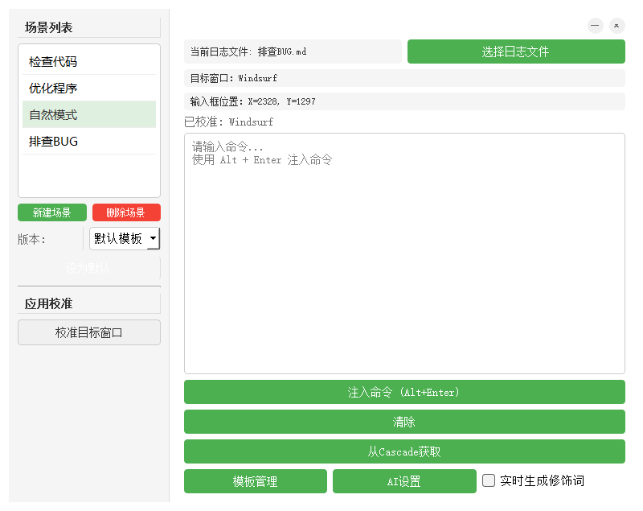

排查BUG，文档或者需求格式
1. 更新时间
2. 项目（是否能自动获取文件夹）
3. IDE的名字
4. 通过截图和交互，在完成任务的时候，提交一个概述报告，内容包括但不限于：
	- 问题发生的部位，前端：页面-组件名字；后端：模块-函数-路径等等
	- 你的诊断的问题：具体到函数名字，类，路径名字
	- 你的措施：具体到函数，修改路径等等；
5. 将这个报告自动更新到指定的维修文档；
# 2025-04-23 11:29:10 (Windsurf)

1. 截图中下拉菜单要改成模式选择列表
2. 列表要能和模版管理的操作（增加，删除模板）同步
3. 点选模板后，被选中的要标示“被选中”

# 2025-04-23 11:54:23 (Windsurf)



